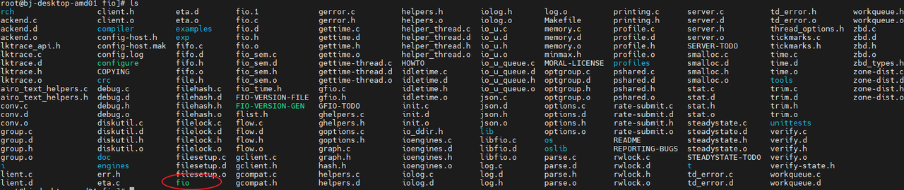
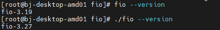
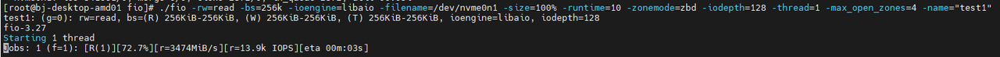
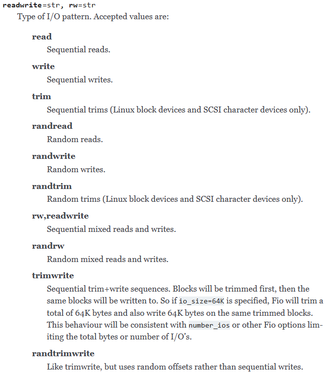
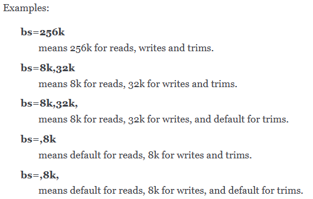

## 一、FIO安装

​	


### 1、可以使用系统自带的包管理进行安装

```shell
sudo yum install fio
```

​	


### 2、从源码安装

一般系统包管理自带的fio比较老旧，很多时候需要从源码编译特定版本的fio进行使用。源码可以从<https://github.com/axboe/fio>获取。

获取源码后解压缩就可以进行编译了，编译命令如下：

```shell
./configure
make
make install
```

如果不需要安装也可以不使用make install，使用的时候直接用编译目录下的fio文件就可以



使用fio --version可以查看版本



​	


## 二、FIO使用

FIO可以使用命令行options或者jobfile进行指定

​	


### 1、使用命令行参数指定



```shell
fio -rw=read -bs=256k -ioengine=libaio -filename=/dev/nvme0n1 -size=100% -runtime=10 -zonemode=zbd -iodepth=128 -thread=1 -max_open_zones=4 -name="test1"
```

​	


### 2、使用job file

```shell
[global]
rw=randwrite
size=100%
zonemode=zbd
bs=256k
direct=1
ioengine=liaio
offset=0
iodepth=256
thread=1
max_open_zones=8
runtime=120
numjobs=2

[job1]
filename=/dev/nvme0n1

```

可以使用 fio jobfile 这样的方式进行测试。

​	


### 3、参数含义说明

IO类型  rw/readwrite



Block size设置每条命令读写数据大小



​	


## FIO的参数说明可以参考下面的文档：

<https://fio.readthedocs.io/en/latest/fio_doc.html#job-file-format>

