# 1、ZNS SSD简介

ZNS SSD即分区命名空间固态硬盘，ZNS 是从 OC（Open Channel，开放通道）SSD基础上发展而来的，实现了把FTL（Flash Translation Layer，闪存转换层）从SSD内部迁移到上层的Host端，把SSD内部开放给了Host端，这样用户可以根据自己需要，比较灵活的拥有自己特定的 FTL，代价是如果存储系统不是追加写的设计，则软件架构必须重新设计为追加写的模型，成本非常高，对用户技术实力要求也非常高。 ZNS协议将Open Channel 2.0进行了标准化处理，以满足行业需求，与Open Channel协议相比之下ZNS SSD规范更加标准，生态环境更加友好，简化了软件架构，用户可以更加容易地根据自身场景需求进行特定软件开发。

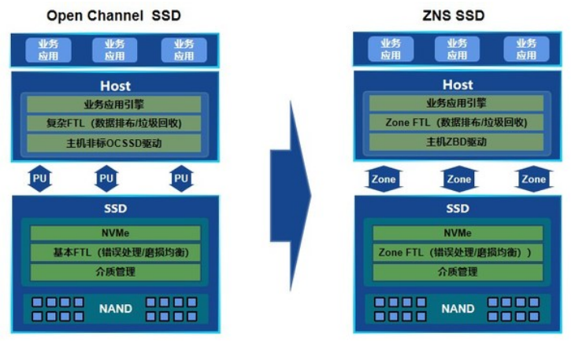

ZNS SSD将FTL移至Host端进行数据管理和I/O调度，ZNS提供了分区存储设备接口，该接口允许SSD和主机在数据放置方面进行协作，根据数据类型的不同选择单独的存放位置，从而可以将数据与SSD的物理介质对齐，抹掉了盘内GC带来的写放大，提高了总体性能，为GC预留的OP空 间也可以暴露给用户使用，增加了主机能直接读写的容量，并实现了多流顺序写的物理隔离。

| ZNS SSD各层           | 功能                                                         |
| --------------------- | ------------------------------------------------------------ |
| ZNS SSD内部（硬盘侧） | ZoneFTL（逻辑Zone->Flash映射、WL、error handling、Nand介质管理) |
| 业务层（Host侧）      | ZoneFTL（数据排布、GC）                                      |

ZNS规范中，将SSD namespace的整个LBA（logical block address，逻辑区块地址）范围划分为若干个等长的区间：zone，每个zone内必须以顺序的方式进行写入，每个zone有其独立的状态机进行管理。

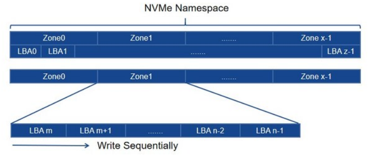

ZNS SSD内部可以根据不同的应用场景将不同的zone与不同的物理位置进行映射。

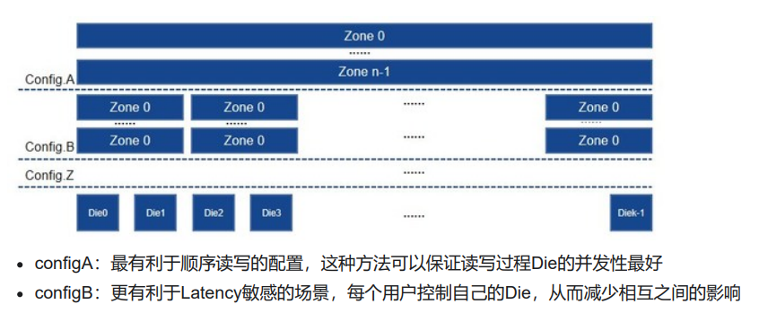

由于zone内要求必须顺序写入，这样在多线程写入同一个zone时，线程之间会因为写入指针的竞争导致写入速度受限或者出现写入位置不正确的问题，这样同一个zone的写入队列深度不能超过1，为了解决这个问题，ZNS提供了append附加写和ZRWA（Zone Random Write Area，分区随 机写入区）两种写入模式：

-  其一，Append写入模式。Append命令将由SSD决定写入的LBA，并返回给用户，这样消除了主机软件间的zone写入位置竞争问题。 

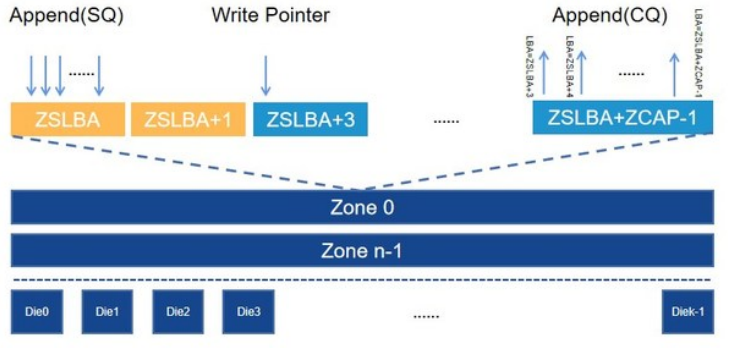

- 其二，ZRWA允许在SSD缓存中对数据进行随机写入和就地覆盖。与Zone Append命令相比，这种方法在SSD上需要更多的资源。

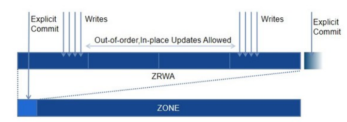

​	

# 2、普通NVMe SSD vs ZNS SSD 

普通NVMe SSD产品，文件不能被驱动器分开写入，最终导致具有不同生存期的文件被存储在相同的erase单元中，而ZNS SSD支持主机与存储设备协作放置数据，可以实现应用程序控制区域中的数据放置，即分区存储。 ZNS SSD主要是为了能够充分利用底层介质的存储容量，同时发挥介质本身的特性优势，例如ZNS针对QLC NAND闪存SSD，它可以根据数据的类型和访问频率采用不同的数据分区方式，以减少整体写放大，从而延长硬盘寿命， 同时，还可以改进的I/O访问延迟，支持主机与存储设备协作放置数据，如下图展示了普通SSD与ZNS区别。

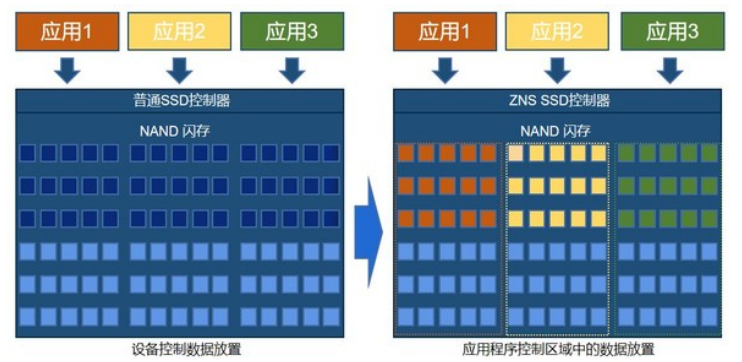

ZNS SSD要求所有zone只能顺序写入（或者append等），不能出现复写操作，重新使用前需要对zone执行zone reset命令等，这样应用及驱动都需要更多的配合ZNS SSD，不过当前各大存储系统及开源工具都已经或者计划完成ZNS SSD的适配与支持,标准化的接口实现了强大的软件和硬件生态系统。 

相比普通SSD产品，ZNS SSD主要有几大优势： 

- 消除了SSD的GC（Garbage Collection，垃圾回收）进程的WAF（Write Amplification，写放大）
- 消除了传统的OP（Over provisioning，预留空间）空间
- 较小的映射表，DRAM更少
- 更高的吞吐量和更低的延迟、大幅提升SSD盘寿命

​	

# 3、ZNS Spec

## 3.1 Zone State

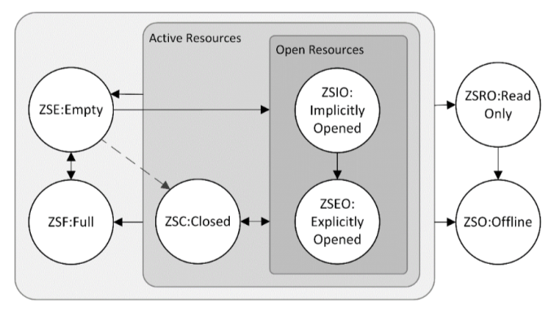

Zone状态：

| Zone State             | 描述                                                         |
| ---------------------- | ------------------------------------------------------------ |
| ZSE:Empty              | ZM Reset命令设置                                             |
| ZSIO:Implicitly Opend  | 隐式打开，隐含在Write Command                                |
| ZSEO:Explicitly Opened | 被 ZM Open打开，显式打开                                     |
| ZSC:Closed             | 被 ZM Close命令显式关闭                                      |
| ZSF:Full               | Write command写满2. 由于ZM Finish 3. 由于Zone Active Excursion |
| ZSRO:Read Only         | 只读状态                                                     |
| ZSO:Offline            | 无法读写                                                     |

- 隐式和显式打开区别：

SSD控制器可以自由地自动关闭通过写命令隐式打开的区域；显式打开的区域只有在主机软件发出命令时才会处于关闭状态 如果ZNS SSD打开的区域数量达到最大值，并且它们都是显式打开的，那么任何打开新区域的尝试都将失败。但是，如果其中一些区域只是隐式打开的，那么尝试打开一个新区域将导致SSD关闭其中一个。

- ZM（Zone Management，zone管理）command，及控制zone状态变化如下：

| ZM Management Command | 用法                                                         |
| --------------------- | ------------------------------------------------------------ |
| Open Zone             | ZSE:Empty → ZSEO:Explicitly ZSIO:Implicitly → ZSEO:Explicitly ZSC:Closed → ZSEO:Explicitly |
| Reset Zone            | ZSIO:Implicitly → ZSE:Empty ZSEO:Explicitly → ZSE:Empty ZSC:Closed → ZSE:Empty ZSF:Full → ZSE:Empty |
| Finish Zone           | ZSE:Empty → ZSF:Full ZSIO:Implicitly → ZSF:Full ZSEO:Explicitly → ZSF:Full ZSC:Closed → ZSF:Ful |
| Close Zone            | ZSIO:Implicitly → ZSC:Closed ZSEO:Explicitly → ZSC:Closed    |
| Offline Zone          | ZSRO:Read Only → ZSO:Offline                                 |

在正常工作过程中，zone的状态变化需要ZM命令的参与：Empty → < ZM Open > → Explicitly Opened → < Append Write Operations >/< ZM finish > → Full → < ZM Reset > → Empty 

一个zone只有在Open状态下才可以写入数据；擦除可以使写满的zone回退到Empty状态；在zone的内部Nand介质达到磨损极限后处于Offline状态。它的正常工作状态变化过程为：Empty → Open → Full → Empty

​	

## 3.2  Zone Descriptor

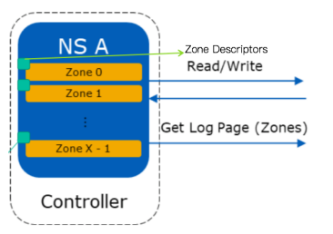

| Zone Descriptor (64 Bytes)      | 描述                                                   |
| ------------------------------- | ------------------------------------------------------ |
| Zone Type                       | 区分Sequential/Random Write                            |
| Zone State                      | 参考3.1                                                |
| WritePointer                    | 参考3.3                                                |
| ZSLBA                           |                                                        |
| Zone Capacity                   | 参考3.4                                                |
| Zone Descriptor Extension Valid |                                                        |
| Reset Zone Recommended          |                                                        |
| Finish Zone Recommended         | Zone Finished by host                                  |
| Zone Finished by Controller     | 由于Zone Active Excursion，zone Finished By controller |

​	

## 3.3 WritePointer

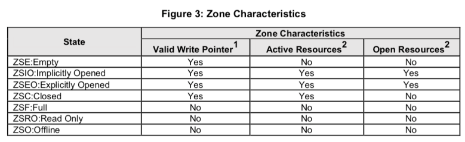

Valid WritePointer指wp在zone中包含一个特定的LBA地址

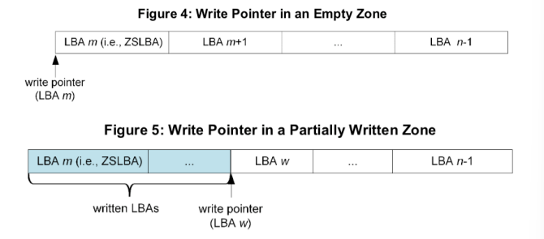

​	

## 3.4 Zone Size & Zone Capacity

- Zone Size是固定的
- Zone Capacity是zone的可写区域

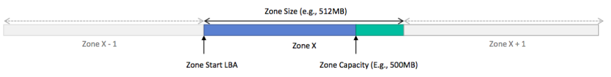

​	

## 3.5 Zoned Admin Command

| Admin Command Set    | 描述                                |
| -------------------- | ----------------------------------- |
| Identify Namespace   | 定义Zone Size, MaxOpenzoneLimit     |
| Async Events         | Zone Descriptor Changed             |
| Log Pages            | SMART Info Host Read/Write commands |
| Set Features Command |                                     |
| Sannitize Command    |                                     |

​	

## 3.6 Zoned IO Commands

| Zoned I/O commands            | I/O commands                                                 |
| ----------------------------- | ------------------------------------------------------------ |
| Command Specific Status codes |                                                              |
| NVM command Set I/O commands  | Write/ReadFlush Write Uncorrectable Compare Write Zeros Dataset Management Verify Copy |
| Zone Management Send          | Close/Finish/Open/Reset/Offline Zone                         |
| Zone Management Receive       | Report zones                                                 |
| Zone Append                   |                                                              |

​	

## 3.7 ZNS Extensions: Simple Copy

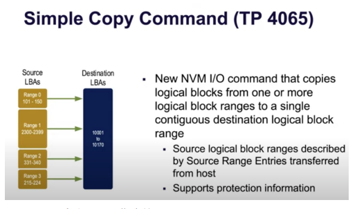

- source: 多个源zone指定的LBA Range lists
- dest: 单个zone指定的LBA + length
- 数据copy通过SSD controller, 不再通过PCIe链路，用于ZNS host GC，仍处于Proposol阶段
- [NVM-Express-1.4-Ratified-TPs.zip](https://nvmexpress.org/wp-content/uploads/NVM-Express-1.4-Ratified-TPs.zip)

​	

# 4、参考资料

- ZNS来了！一文看懂NVMe分区存储！https://www.eet-china.com/mp/a24848.html 
- 浪潮新一代ZNS SSD固态盘解码 https://www.prnasia.com/story/309908-1.shtml 
- OC SSD & ZNS https://blog.shunzi.tech/post/OC-SSD-AND-ZNS/ 
- https://allcom.se/2020/08/06/the-next-step-in-ssd-evolution-nvme-zoned-namespaces-explained
