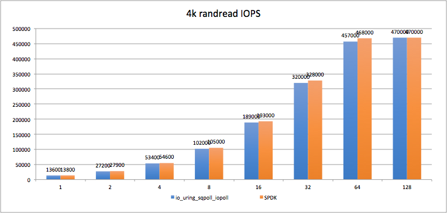

# SPDK简介

SPDK ( Storage performance development kit ) 是是Intel发布的存储性能开发工具集，用于使用 NVMe SSD 作为后端存储的应用软件加速库。该软件库的核心是实现了用户态、异步、无锁、轮询方式的 NVMe 驱动。官方网站是[spdk.io](https://spdk.io/),代码存放在[github](https://github.com/spdk/spdk)上。

与传统 Linux 内核的 NVMe 驱动相比，它可以大幅度降低 NVMe Command 的延迟，同时提高单 CPU 的 IO 处理能力 IOPS，从而形成一套高性价比的解决方案。

SPDK主要解决内核IO栈存在的上下文切换、数据拷贝、中断、资源同步等问题。解决思路包括：

- 用户态驱动：消除了系统调用、用户空间到内核的数据拷贝；
- 轮询模式：节省了中断引起调度开销以及上下文切换；
- 异步IO模式：一次给SQ提交多个读写请求，然后异步检查CQ并回调处理；
- 无锁化：per-core的数据结构设计，每个线程只访问属于自己的内存、SQ&CQ，无锁、无原子操作，QP之间全并发；

​	

# SPDK的结构图(略有落后,最新版本已经ver23.09了)：

SPDK架构整体分为三层,从下往上构建，主要的组件包括：

- **驱动(Drivers)**

**NVMe** **Driver**：SPDK的基础组件，这个高优化无锁的驱动有着高扩展性、高效性和高性能的特点。

**Intel QuickData Technology**：也称为Intel  I/O Acceleration Technology（Inter  IOAT，英特尔I/O加速技术），这是一种基于Xeon处理器平台上的copy  offload引擎。通过提供用户空间访问，减少了DMA数据移动的阈值，允许对小尺寸I/O或NTB的更好利用。

**NVMe** **over Fabrics（NVMe-oF）initiator**：从程序员的角度来看，本地SPDK NVMe驱动和NVMe-oF启动器共享一套共同的API命令。这意味着，例如本地/远程复制将十分容易实现。

​	

- **Storage Services(存储设备)**

**Block device abstration layer（bdev**）：这种通用的块设备抽象是连接到各种不同设备驱动和块设备的存储协议的粘合剂。并且还在块层中提供灵活的API，用于额外的用户功能，如磁盘阵列、压缩、去冗等等。

**Blobstore：**为SPDK实现一个高精简的文件式语义（非POSIX）。这可以为数据库、容器、虚拟机或其他不依赖于大部分POSIX文件系统功能集（比如用户访问控制）的工作负载提供高性能基础。

**Blobstore Block Device：**由SPDK Blobstore分配的块设备，是虚拟机或数据库可以与之交互的虚拟设备。这些设备得到SPDK基础架构的优势，意味着零拷贝和令人难以置信的可扩展性。

**Logical Volume：**类似于内核软件栈中的逻辑卷管理，SPDK通过Blobstore的支持，同样带来了用户态逻辑卷的支持，包括更高级的按需分配、快照、克隆等功能。

**Ceph RADOS Block Device（RBD）**：使Ceph成为SPDK的后端设备，比如这可能允许Ceph用作另一个存储层。

**Linux Asynchrounous** **I/O****（AIO）：**允许SPDK与内核设备（比如机械硬盘）交互。

​	

- **存储协议(Storage Protocols)**

**iSCSI target**：建立了通过以太网的块流量规范，大约是内核LIO效率的两倍。现在的版本默认使用内核TCP/IP协议栈，后期会加入对用户态TCP/IP协议栈的集成。

**NVMe-oF target**：实现了NVMe-oF规范。将本地的高速设备通过网络暴露出来，结合SPDK通用块层和高效用户态驱动，实现跨网络环境下的丰富特性和高性能。支持的网络不限于RDMA一种，FC，TCP等作为Fabrics的不同实现，会陆续得到支持。

**vhost target**：KVM/QEMU的功能利用了SPDK NVMe驱动，使得访客虚拟机访问存储设备时延迟更低，使得I/O密集型工作负载的整体CPU负载减低，支持不同的设备类型供虚拟机访问，比如SCSI, Block, NVMe块设备。

​	

# SPDK与libaio、io_uring的性能对比

## IOPS：

如果我们不考虑CPU Core的使用和限制，从打满单个NVMe SSD角度看，即使在libaio异步处理的情况下，同样可以占用多个CPU Core，分配多个FIO jobs，设置比较高的队列深度，比如常规的 4 jobs * 64队列深度/job，也通常可以把单个NVMe SSD打满。所以在这里，我们更关心的是，在单CPU Core下能输出的最高IOPS的能力。

​	

## IO延时:

从单个IO延时来看，SPDK相对io_uring(非poll模式)也有近60%的优化

当前的IO速度越来越快，使用CPU中断方式会导致进行上下文切换，消耗大量的CPU时间，导致处理速度没有轮询(PMD)这种方式快。

目前io_uring也有类似的polling机制，使用polling机制后，性能与spdk相差很小。

​	

# 事件驱动框架

用户态无锁的NVMe驱动在使用的过程中，如果不能在上层应用中消除IO锁或则应用IO线程模型使用不当，很容易造成无法发挥软硬件性能的问题，因此，SPDK提供了一套标准的应用框架，业务应用可以根据自身情况集成到这套框架中或则参照其进行设计，上面提到的块设备bdev以及更 上层的标准协议服务都运行在这套框架之内。

SPDK应用在启动的时候，可以指定线程数量，用掩码的方式进行标识，标识在那几个指定的CPU核上运行，如上图所示，一个核就会运行一个线程，SPDK把它称为reactor。 

SPDK在其绑定的每一个CPU核心上，会创建一个对应的执行实体Reactor, Reactor。一个Reactor即对应一个pthread，亲和绑定在一个CPU核心上。它始终运行在亲和绑定的CPU核心上，不会被调度去其他CPU核心。所以Reactor与pthread和CPU核心的对应关系为1:1:1。

SPDK在处理存储服务时，会创建一些轻量级协程spdk_thread。根据不同存储服务的特点，SPDK会将某个负载单元完全交给一个spdk_thread去处理，比如一个vhost设备对应一个spdk_thread，该vhost  设备的所有IO请求都会由此spdk_thread处理完成。

spdk_thread需要被放到一个Reactor上去执行，具体到哪一个Reactor是由spdk_thread的CPUMASK决定。例如spdk_thread A, C,  D的CPUMASK分别在Core0,1,2的bit位上置位，它们分别被放置在Core0,1,2上，spdk_thread  B的CPUMASK对Core0,1,2的bit位上均有置位，代表它可以被放置到Core0,1,2任何一个上。在执行过程中，spdk_thread可以动态地从一个Reactor上迁移到另一个Reactor上，如果将spdk_thread  A的CPUMASK更改为2，它将会被从Core0，调度到Core1上去执行。

下面解释一下各个概念：

- reactor：对应一个线程，一个CPU核上就只有一个。reactor线程是SPDK中负责实际业务处理逻辑的单元，它们在vhsot服务启动时创建，直到服务停止。目前还不支持reactor线程的动态增减。
- Events Ring：属于reactor中的结构，一个Reactor只有一个Events Ring，它是DPDK实现的MPSC(多生产者单消费者)无锁循环队列，用于完成不同Reactor之间的通信；当一个Reactor需要发送消息给另一个Reactor时，只要将消息放到对应Reactor的Events Ring中即可，接收到消息 的Rector取出消息后就就会将消息删除。
- Thread：属于reactor中的结构，包括一个或者多个。
- pollers：一个Thread会包括两类poller，active_poller用于包括多个不断运行的消息，timed_poller用于包括多个定时运行的消息。
- io_channel：一个Thread可以包括多个io_channel，每个channel对应了一个具体的后端实现，例如，在bdev层进行IO之前，需要获取对应设备的io_channel。
- msg ring：一个Thread包含了一个MPSC(多生产者单消费者的)消息环，用于存储那些只运行一次的消息。

Reactor线程就是一个while死循环，首先会检查Events Ring是否有消息，有消息则进行处理，然后轮询每一个Thread，处理msg ring，运行poller，如此循环往复。

​	

# PMD

PMD是Poll Mode Driver的缩写，即基于用户态的轮询机制的驱动。

​	

# 无锁化处理

## io-channel

SPDK  的IO是一种run-to-completion模式，即IO从接收进入SPDK开始，直到IO结束都是在同一个核上处理，这样SPDK的IO处理就不存在资源竞争，处于一种无锁化模式。此外，当多个spdk_thread操作同一个block  device (bdev)时，SPDK提供了一个IO  channel的概念与bdev之间建立映射关系；即不同的thread操作同一个bdev时，应该拥有不同的IO channel， 每个IO  channel在IO路径上使用自己独立的资源不存在资源竞争从而免锁。

​	

## 无锁环形队列(Ring)

DPDK中的环形结构经常用于队列管理，因此又称为环形队列。它不同于大小可灵活变化的链表，它的空间大小是固定的。

**DPDK****中的rte_ring拥有如下特性：**

- 它是一种FIFO(First In First Out)类型的数据结构；
- 无锁；
- 多消费者、单消费者出队；
- 多生产者、单生产者入队
- 批量出队；
- 批量入队；
- 全部出队；
- 全部入队；

参考；

[9. Ring Library ‒ Data Plane Development Kit 23.11.0-rc1 documentation](http://doc.dpdk.org/guides/prog_guide/ring_lib.html)

​	

# CPU绑定

cpumask、Reactor、spdk_thread 简略关系图如下所示：

Reactor 与CPU是一一对应的，在一个Reactor上可以绑多个spdk_thread,一般是一个Reactor绑定一个cpu

​	

## **CPU****亲和性**

我们通常说的CPU绑定其实也叫设置CPU的亲和性，也就是cpu affinity机制，指的是进程要在指定的 CPU 上**尽量长时间地运行而不被迁移到其他处理器**, 通过处理器关联可以将虚拟处理器映射到一个物理处理器上 ，也就是说把一个程序绑定到一个物理CPU上。

而且在多核运行的机器上，每个CPU本身自己会有缓存，缓存着进程使用的信息，而进程可能会被OS调度到其他CPU上，如此，CPU  cache命中率就低了。当一个进程或线程绑定CPU后，程序就会一直在指定的cpu跑，不会由操作系统调度到其他CPU上，减少了cache  miss，提高性能和效率。

SPDK的Reactor为了能够达到最高的效率，需要设置这个CPU亲和性，保证在polling的时候不会被调度到其他CPU核上，保证最大性能。

​	

## **NUMA机制**

一个物理cpu对应一个node,系统还会为每个node分配一定的大小的内存。也就是说如果服务器只有一个物理cpu,那么就只有一个node0,领取系统全部的内存和cpu。个人的PC好像也只有一个CPU，所以只有node0。但是在大型的服务器上会有多个node，这时每个node都会被分配到一定的内存。

CPU访问自身直接attach内存（就是系统给每个node分配的内存）对应的物理地址时,才会有较短的响应时间,俗称Local  Access,如图标识的”fast”,如果需要访问其他cpu  attach的内存的数据时,就需要通过inter-connect通道来访问,相比之前的访问速度要慢一些,俗称Remote Access  ,如图标识的”slow”,那么在dpdk的使用过程中,配置NUMA模式和NoNUMA模式是加快访问速度的方法而已。

​	

# **大页内存**

CPU缓存中有一组缓存专门用于缓存TLB，但其大小是有限的。当采用的默认页面大小为 4KB，其产生的TLB较大，因而将会产生较多 TLB Miss 和缺页中断，从而大大影响应用程序的性能。操作系统以 2MB 甚至更大作为分页的单位时，将会大大减少 TLB Miss 和缺页中断的数量，显著提高应用程序的性能。这也正是Linux内核引入大页面支持的直接原因。为了能以最小的代价实现大页面支持，Linux操作系统采用了基于hugetlbfs特殊文件系统2M字节大页面支持。

***Note：***

大页内存是全系统共享的，**不是****SPDK****独占的**，所以SPDK在使用的时候也要考虑大页内存是否够用，会不会被其他进程抢占的问题。

[forum.huawei.com](https://forum.huawei.com/enterprise/zh/thread/580931816834088960)

[Linux 操作系统原理 — 内存 — 大页内存-云社区-华为云](https://bbs.huaweicloud.com/blogs/291868)

​	

## DPDK（Data Plane Development Kit）：高性能数据包处理

DPDK 是一款用于高性能数据包处理的开源软件库和工具集，专注于用户级协议栈。它的设计目标是提供在网络功能虚拟化（NFV）、云计算、边缘计算等领域中实现高吞吐量和低延迟的网络应用所需的性能和可伸缩性。

DPDK 的典型应用场景包括但不限于：

**虚拟路由器（Virtual Routers）：** 通过 DPDK，可以实现高性能的虚拟路由器，提供快速的数据包路由和转发功能，适用于数据中心和云环境中的虚拟化网络。

**防火墙（Firewalls）：** DPDK 可用于构建高吞吐量的防火墙应用，实现对网络流量的深度包检查和过滤。

**负载均衡器（Load Balancers）：** 在负载均衡器中使用 DPDK 可以实现快速的流量分发和请求处理，确保服务的高可用性和性能。

**网络包分析器（Network Packet Analyzers）：** DPDK 提供了处理网络流量的能力，可用于构建网络包分析工具，帮助监控和故障排除网络。

目前SPDK运用了 DPDK 的技术和理念,包括用户态，内存零拷贝，大页，无锁队列。

SPDK中使用了DPDK中的以下模块：

- **librte_eal**：DPDK的核心模块，提供内存管理、线程管理、设备管理等功能。
- **librte_mempool**：DPDK的内存池模块，提供大块内存的分配和释放功能。
- **librte_pci**：DPDK的PCIe设备模块，提供PCIe设备的驱动和管理功能。
- **librte_ring**：DPDK的环形缓冲区模块，提供高效的数据传输功能。
- **librte_ethdev**：DPDK的以太网设备模块，提供以太网设备的驱动和管理功能。

​	

# UIO和vFio设备

## UIO

UIO(Userspace I/O)，用户空间下驱动程序的支持机制。Linux系统中一般的驱动设备都是运行在内核空间，而在用户空间用应用程序调用即可，而UIO则是将驱动的很少一部分运行在内核空间，而在用户空间实现驱动的绝大多数功能。使用UIO可以**避免设备的驱动程序需要随着内核的更新而更新的问题。

​	

## VFIO

**VFIO(Virtual Function** **I/O** **)** 是一种现代化的设备直通方案，它充分利用了VT-d/AMD-Vi技术提供的DMA Remapping和Interrupt Remapping特性，在保证直通设备的DMA安全性同时可以达到接近物理设备的I/O的性能。 用户态进程可以直接使用VFIO驱动直接访问硬件，并且由于整个过程是在IOMMU的保护下进行因此十分安全， 而且非特权用户也是可以直接使用。 换句话说，VFIO是一套完整的用户态驱动(userspace driver)方案，因为它可以安全地把设备I/O、中断、DMA等能力呈现给用户空间。

因此，在使用VFIO设备的时候要确保开启IOMMU,否则无法在运行setup.sh的时候切换到VFIO驱动。

参考：

[虚拟化 vfio 和UIO 区别](https://zhuanlan.zhihu.com/p/544076987)

[SPDK编译](https://dapustor.feishu.cn/docx/ERk2dvNOJouWTgxIW9nc5KhonnU) 

[SPDK环境设置和问题解决](https://dapustor.feishu.cn/docx/SrgGdMcJSojfmpxK4POc4f2UnYf) 
